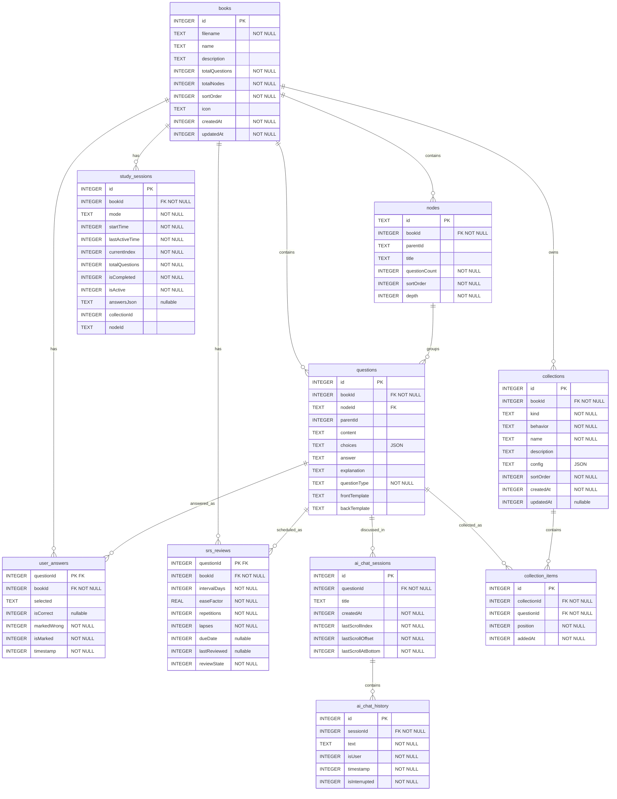
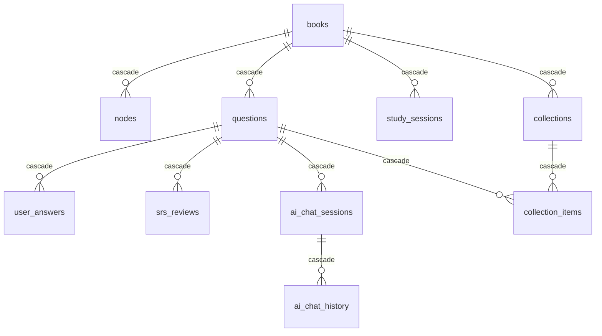
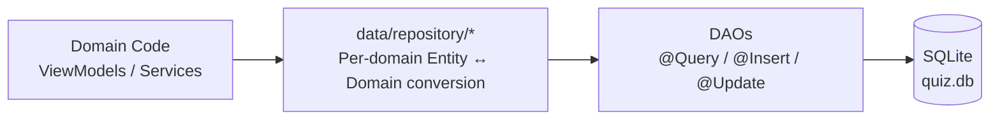

# Database Design

Mnemora stores app content and study state in a local Room database named
`quiz.db`. The current Room schema is `AppDatabase` version 21, exported under
`app/schemas/com.hihusky.mnemora.data.local.db.AppDatabase/21.json`.

The database is local-first and intentionally scoped to app data. User settings
such as AI provider, model, sound, and haptic preferences live in DataStore via
`SettingsRepository`, not in Room.

## Ownership

| Layer | Code | Responsibility |
|---|---|---|
| Database | `data/local/db/AppDatabase.kt` | Declares all Room entities and DAOs |
| DI | `di/DatabaseModule.kt` | Builds the singleton Room database as `quiz.db` |
| Entities | `data/local/db/entity/` | Defines table names, columns, foreign keys, and indexes |
| DAOs | `data/local/db/dao/` | Owns SQL queries and insert/update/delete operations |
| Repositories | `data/repository/` | One repository per domain (books, questions, answers, SRS, chat, collections, sessions); converts entities to domain models and coordinates DAO calls |
| Import | `domain/service/BookImporter.kt` | Inserts books, nodes, and questions inside a Room transaction |

## Naming Direction

`books` is the historical table name. It is not the best name for the current
domain because the top-level object is an imported question package/question
bank, not necessarily a book. The product language should move toward
`package` or `question_bank`. The current code keeps `books` / `BookEntity` for
compatibility with the existing repository and UI, but new design work should
treat it as the package boundary and avoid adding new cross-package behavior.

## Entity Map



`nodes.parentId` and `questions.parentId` are logical parent links. They are
not declared as self-referencing foreign keys.

## Tables

### `books`

Imported package metadata.

| Column | Type | Notes |
|---|---|---|
| `id` | `INTEGER` | Auto-generated primary key |
| `filename` | `TEXT NOT NULL` | Package id; import skips duplicates by matching this value |
| `name` | `TEXT` | Display name from `data.json`, defaults to `Imported` during import |
| `description` | `TEXT` | Optional package description |
| `totalQuestions` | `INTEGER NOT NULL` | Updated after import transaction counts inserted questions |
| `totalNodes` | `INTEGER NOT NULL` | Updated after import transaction counts inserted nodes |
| `sortOrder` | `INTEGER NOT NULL` | Manual ordering tie-breaker |
| `icon` | `TEXT` | Optional package icon value |
| `createdAt` | `INTEGER NOT NULL` | Millisecond timestamp |
| `updatedAt` | `INTEGER NOT NULL` | Millisecond timestamp; defaults to `createdAt` |

Library ordering uses `MAX(study_sessions.lastActiveTime)` first, then
`books.updatedAt`, `books.createdAt`, `sortOrder`, and `id`.

### `nodes`

Tree nodes inside a book.

| Column | Type | Notes |
|---|---|---|
| `id` | `TEXT` | Primary key generated during import from package id, depth, and sibling index |
| `bookId` | `INTEGER NOT NULL` | Foreign key to `books.id`, cascade delete |
| `parentId` | `TEXT` | Logical parent node id; `NULL` means root |
| `title` | `TEXT` | Optional node title |
| `questionCount` | `INTEGER NOT NULL` | Reserved count field; current import leaves this at default `0` |
| `sortOrder` | `INTEGER NOT NULL` | Sibling order from package position |
| `depth` | `INTEGER NOT NULL` | Import depth, starting at `0` |

Indexes: `bookId`, `parentId`.

The package schema permits arbitrary nesting, but `BookImporter` rejects imports
deeper than 5 levels to keep the UI manageable.

### `questions`

Question records imported from package `data.json`.

| Column | Type | Notes |
|---|---|---|
| `id` | `INTEGER` | Auto-generated primary key |
| `bookId` | `INTEGER NOT NULL` | Foreign key to `books.id`, cascade delete |
| `nodeId` | `TEXT` | Foreign key to `nodes.id`, cascade delete |
| `parentId` | `INTEGER` | Logical parent question id for passage sub-questions |
| `content` | `TEXT` | Prompt, passage, or flashcard content |
| `choices` | `TEXT` | JSON array of `QuestionChoice` objects |
| `answer` | `TEXT` | Correct answer payload |
| `explanation` | `TEXT` | Optional explanation |
| `questionType` | `TEXT NOT NULL` | Protocol value, defaults to `multiple_choice` |
| `frontTemplate` | `TEXT` | Optional flashcard front template |
| `backTemplate` | `TEXT` | Optional flashcard back template |

Indexes: `bookId`, `nodeId`.

Supported question type values are `multiple_choice`, `true_false`,
`fill_blank`, `cloze`, `flashcard`, and `passage`. Unknown protocol values map
to `QuestionType.Unknown` in the domain model. `passage` questions are treated
as non-answerable parent content; `QuestionDao.getAnswerableQuestionIds()`
excludes them.

### `user_answers`

Latest per-question answer and mark state.

| Column | Type | Notes |
|---|---|---|
| `questionId` | `INTEGER` | Primary key; foreign key to `questions.id`, cascade delete |
| `bookId` | `INTEGER NOT NULL` | Foreign key to `books.id`, cascade delete |
| `selected` | `TEXT` | User-selected answer payload |
| `isCorrect` | `INTEGER` | Nullable boolean encoded as `1` / `0`; `NULL` means no current answer |
| `markedWrong` | `INTEGER NOT NULL` | Legacy/manual wrong marker field; current queries use `isCorrect = 0` |
| `isMarked` | `INTEGER NOT NULL` | Bookmark flag encoded as `1` / `0` |
| `timestamp` | `INTEGER NOT NULL` | Millisecond timestamp for latest answer or mark update |

Index: `bookId`.

Saving an answer uses `OnConflictStrategy.REPLACE`, so there is one current
answer row per question. Clearing an answer sets `selected` and `isCorrect` to
`NULL` while preserving the row and any mark state.

### `srs_reviews`

Spaced repetition scheduling state per question.

| Column | Type | Notes |
|---|---|---|
| `questionId` | `INTEGER` | Primary key; foreign key to `questions.id`, cascade delete |
| `bookId` | `INTEGER NOT NULL` | Foreign key to `books.id`, cascade delete |
| `intervalDays` | `INTEGER NOT NULL` | Current review interval |
| `easeFactor` | `REAL NOT NULL` | Scheduling ease factor, default `2.5` |
| `repetitions` | `INTEGER NOT NULL` | Successful review count |
| `lapses` | `INTEGER NOT NULL` | Failed review count |
| `dueDate` | `INTEGER` | Nullable millisecond timestamp |
| `lastReviewed` | `INTEGER` | Nullable millisecond timestamp |
| `reviewState` | `INTEGER NOT NULL` | Ordinal for `New`, `Learning`, `Review`, `Relearning` |

Indexes: `bookId`, `dueDate`.

Due review queries select rows with `dueDate <= now`. SRS stats group
`reviewState = 0` as new cards, `1` and `3` as learning, and `2` as review.

### `ai_chat_sessions`

AI chat sessions attached to a question.

| Column | Type | Notes |
|---|---|---|
| `id` | `INTEGER` | Auto-generated primary key |
| `questionId` | `INTEGER NOT NULL` | Foreign key to `questions.id`, cascade delete |
| `title` | `TEXT` | Session title |
| `createdAt` | `INTEGER NOT NULL` | Millisecond timestamp |
| `lastScrollIndex` | `INTEGER NOT NULL` | Restored first visible item index, default `0` |
| `lastScrollOffset` | `INTEGER NOT NULL` | Restored pixel offset of the first visible item, default `0` |
| `lastScrollAtBottom` | `INTEGER NOT NULL` | Whether the sheet was pinned to the bottom, default `1` |

Index: `questionId`.

Sessions for a question are shown newest first by `createdAt DESC`. The three
scroll columns persist the bottom-sheet reading position so reopening a
session restores the user's place.

### `ai_chat_history`

Messages inside an AI chat session.

| Column | Type | Notes |
|---|---|---|
| `id` | `INTEGER` | Auto-generated primary key |
| `sessionId` | `INTEGER NOT NULL` | Foreign key to `ai_chat_sessions.id`, cascade delete |
| `text` | `TEXT NOT NULL` | Message body |
| `isUser` | `INTEGER NOT NULL` | Boolean encoded as `1` for user and `0` for assistant |
| `timestamp` | `INTEGER NOT NULL` | Millisecond timestamp |
| `isInterrupted` | `INTEGER NOT NULL` | Boolean encoded as `1` when the stream was stopped early, default `0` |

Index: `sessionId`.

Messages are read oldest first by `timestamp ASC`. Interrupted assistant
messages are offered a "continue" affordance in the UI.

### `collections`

User-defined or smart collections scoped to one imported package.

| Column | Type | Notes |
|---|---|---|
| `id` | `INTEGER` | Auto-generated primary key |
| `bookId` | `INTEGER NOT NULL` | Foreign key to `books.id`, cascade delete |
| `kind` | `TEXT NOT NULL` | `custom` or `smart`, mapped case-insensitively |
| `behavior` | `TEXT NOT NULL` | `manual` or `smartfilter`, mapped case-insensitively |
| `name` | `TEXT NOT NULL` | Display name |
| `description` | `TEXT` | Optional description |
| `config` | `TEXT` | Optional behavior config JSON |
| `sortOrder` | `INTEGER NOT NULL` | Collection ordering |
| `createdAt` | `INTEGER NOT NULL` | Millisecond timestamp |
| `updatedAt` | `INTEGER` | Nullable millisecond timestamp |

Indexes: `bookId`, `kind`.

Collections no longer support cross-package membership. The current UI creates
manual custom collections from the package detail screen. Smart collection
fields exist in the schema and model, but smart filtering is not yet implemented
in DAO queries.

### `collection_items`

Membership rows connecting package-local collections directly to questions.

| Column | Type | Notes |
|---|---|---|
| `id` | `INTEGER` | Auto-generated primary key |
| `collectionId` | `INTEGER NOT NULL` | Foreign key to `collections.id`, cascade delete |
| `questionId` | `INTEGER NOT NULL` | Foreign key to `questions.id`, cascade delete |
| `position` | `INTEGER NOT NULL` | Manual ordering inside the collection |
| `addedAt` | `INTEGER NOT NULL` | Millisecond timestamp |

Indexes: `collectionId`, `questionId`, unique `(collectionId, questionId)`.

Collection detail reads join `collection_items` directly to `questions`, ordered
by `position ASC, addedAt ASC`.

### `study_sessions`

Study progress and records for Practice, Review, Preview, and Test modes.

| Column | Type | Notes |
|---|---|---|
| `id` | `INTEGER` | Auto-generated primary key |
| `bookId` | `INTEGER NOT NULL` | Foreign key to `books.id`, cascade delete |
| `mode` | `TEXT NOT NULL` | `Practice`, `Review`, `Preview`, or `Test` |
| `startTime` | `INTEGER NOT NULL` | Millisecond timestamp |
| `lastActiveTime` | `INTEGER NOT NULL` | Millisecond timestamp used for recency |
| `currentIndex` | `INTEGER NOT NULL` | Last known position in the session |
| `totalQuestions` | `INTEGER NOT NULL` | Session question count |
| `isCompleted` | `INTEGER NOT NULL` | Boolean encoded by Room |
| `isActive` | `INTEGER NOT NULL` | Resume eligibility flag encoded by Room |
| `answersJson` | `TEXT` | Optional serialized answer state |
| `collectionId` | `INTEGER` | Optional collection context; not a declared foreign key |
| `nodeId` | `TEXT` | Optional node context; not a declared foreign key |

Indexes: `(bookId, mode, isActive)`, `(bookId, startTime)`.

The DAO keeps at most one active session per book and mode by explicitly
deactivating previous sessions before creating or resuming flows. Test-mode
resume is intentionally limited because test questions are reshuffled on load;
see ADR-0006.

## Core Flows

### Package import

1. `PackageService` validates a `.zip`, `.quizpkg`, or `.mnemorapkg` archive.
2. The archive is extracted into internal storage under `files/packages/<packageId>`.
3. `data.json` is decoded into plain values.
4. `BookImporter.importData()` checks `books.filename` for duplicate package ids.
5. A Room transaction inserts one `books` row, all `nodes`, all `questions`, and
   finally updates `books.totalQuestions` and `books.totalNodes`.

If the import fails, the transaction rolls back and the extracted package
directory is deleted by `PackageService`.

### Practice and test answers

Answer state is stored in `user_answers` by `questionId`. This means the table
stores the latest known answer per question rather than a historical answer log.
Session history and resume position are tracked separately in `study_sessions`.

### Review scheduling

Review mode reads due question ids from `srs_reviews` and writes the updated
scheduling state back to the same row with `OnConflictStrategy.REPLACE`.
Question content remains in `questions`.

### Collections

Collections point directly at `questions`. `collections.bookId` ensures
collection lists are shown only within the owning package, and repository code
validates package ownership before adding a question to a collection. There is
no snapshot table; `questions` is the single source of truth for question
content.

### AI chat

AI chat data is scoped to questions. Deleting a question cascades to its chat
sessions, and deleting a chat session cascades to its messages.

## Deletion and Cascades

Deleting a `books` row is the package-level deletion operation. It cascades
through declared foreign keys to `nodes`, `questions`, `user_answers`,
`srs_reviews`, `study_sessions`, and `collections`. Deleting questions cascades
to AI chat sessions, AI chat history, and collection items that reference those
questions.



The cascade is guaranteed by SQLite. There is no repository-level cleanup loop.

Non-declared foreign keys — `nodes.parentId`, `questions.parentId`,
`study_sessions.collectionId`, `study_sessions.nodeId` — are logical links
only. They do not cascade because Room auto-generates primary keys for these
references.

## Schema-as-Contract

Every Room schema version is exported as JSON under
`app/schemas/com.hihusky.mnemora.data.local.db.AppDatabase/`. These files
serve as the authoritative record of the database shape at each version.

This pattern supports:

- Migration verification: Room can diff the expected schema against the actual
  database file.
- Tooling: schema files can be used to generate documentation or migration
  scripts.
- Historical traceability: future developers can see exactly what changed
  between versions.

`DatabaseModule` builds Room with
`.addMigrations(*DatabaseMigrations.ALL_MIGRATIONS)`. Before shipping with persistent user data,
hand-written migrations must be added to `DatabaseMigrations` and tested against the exported schemas.

Database backup is excluded by `res/xml/backup_rules.xml` and
`res/xml/data_extraction_rules.xml`.

## Design Patterns

### Pattern Summary

| Pattern | Where Applied | Problem It Solves |
|---|---|---|
| Repository | `data/repository/*` (one per domain) | Decouples domain logic from persistence details |
| Data Access Object | `data/local/db/dao/` | Encapsulates SQL in a single responsibility class |
| Local-first persistence | Entire Room layer | Offline capability; no network dependency |
| Single source of truth | `questions`, `user_answers` | Prevents stale or conflicting data |
| Transactional boundary | `BookImporter`, import flows | Atomic multi-entity writes |
| Cascade delete | Foreign key declarations | Ensures referential integrity on deletion |
| Schema-as-contract | Exported JSON schemas | Enables migration verification and tooling |
| Storage segregation | DataStore vs Room | Separates mutable preferences from structured data |
| Soft state | `user_answers` REPLACE | Avoids unbounded append-only history |
| Redundant foreign key | `bookId` on child tables | Simplifies repository-scoped queries |

### Repository Pattern



Each domain owns its repository — `BookRepository`, `QuestionRepository`,
`SrsRepository`, `ChatRepository`, and so on. Each repository converts Room
entities into domain models and back, so the rest of the app never imports
`data.local.db.entity.*`. This keeps the domain layer independent of the
storage schema.

Repositories are also where coordination logic lives — for example, when
adding a question to a collection, the repository validates package ownership
before calling the DAO, and `SrsRepository.applyRating` advances the
scheduling state before persisting the updated row.

### Data Access Object (DAO)

Room DAOs in `data/local/db/dao/` own every SQL query. ViewModels and
repositories never write raw SQL. Two benefits:

- **Testability**: DAOs can be unit-tested with Room's in-memory database
  without involving repositories or ViewModels.
- **Discoverability**: Every query that touches a table lives in that table's
  DAO. There is no scattered `rawQuery` call hidden in a ViewModel.

Each DAO declares queries through annotated interface methods (`@Query`,
`@Insert`, `@Update`, `@Delete`). Suspending functions are used for writes;
`Flow` return types are used for reactive reads.

### Local-First Persistence

The database is entirely local. There is no remote server, no sync engine, and
no network dependency for reading or writing. Imports are the only external
data path (`.zip`, `.quizpkg`, `.mnemorapkg` archives).

This avoids race conditions between local and remote writes, conflict resolution
logic, and offline/online state management. The trade-off is that data lives
only on the device.

### Single Source of Truth

Each domain concept maps to one table, and no data is duplicated across tables.
Examples:

- `questions` is the only table that stores question content. Collections
  reference questions by id through `collection_items` but never copy content
  fields.
- `user_answers` stores exactly one answer row per question (`REPLACE` on
  conflict). There is no separate answer history table.

When displaying both answer state and review state on the same screen, the
repository performs a join in the DAO query rather than denormalizing into a
cache table.

### Transactional Boundary

Operations that modify multiple entities are wrapped in a Room `@Transaction`.
The main example is package import:

```
BookImporter.importData()
  ├── insert books row
  ├── insert all nodes
  ├── insert all questions
  └── update books.totalQuestions / totalNodes
```

If any step fails, the entire import rolls back. Room transactions do not span
filesystem operations, so `PackageService` coordinates directory cleanup in the
caller.

Other transactional boundaries: session creation (deactivate previous + insert
new) and collection membership changes (validate ownership + insert/delete
items).

### Storage Segregation

The app splits persistent data into two stores:

| Store | Technology | Content |
|---|---|---|
| Room (`quiz.db`) | SQLite | App content: packages, questions, answers, reviews, collections, AI chat |
| DataStore | Proto / Preferences | User settings: AI provider, model, sound, haptic preferences |

This segregation exists because the datasets have different access patterns:
Room data is queried, joined, filtered, and ordered (benefits from SQL).
Settings are read on app start, written occasionally, and never joined with
other data (key-value is simpler).

`SettingsRepository` wraps DataStore and exposes `Flow<Settings>` for reactive
consumption, mirroring the repository pattern used for Room data.

### Soft State

`user_answers` uses `OnConflictStrategy.REPLACE` to keep exactly one row per
question. Each answer overwrites the previous one for the same question.
Clearing an answer sets `selected` and `isCorrect` to `NULL` instead of
deleting the row, preserving the mark state.

`study_sessions` uses a similar approach: at most one active session per book
and mode is enforced by the DAO deactivating previous sessions before creating
or resuming. Old sessions are retained but marked inactive.

The trade-off is that answer-level analytics (e.g., "how many times did the
user get this wrong?") are not supported. `srs_reviews` captures aggregated
review statistics (`repetitions`, `lapses`) rather than a per-attempt log.

### Redundant Foreign Key

Most child tables carry a `bookId` column in addition to their referenced
entity's primary key. For example, `user_answers` has both `questionId`
(referencing `questions.id`) and `bookId` (referencing `books.id`). Since
`questionId` uniquely identifies the parent question, `bookId` is derivable
through a join — but the redundancy is intentional:

- Repository-scoped queries filter by `bookId` without joining through the
  parent table. `SELECT * FROM user_answers WHERE bookId = ?` is simpler and
  faster than `SELECT ua.* FROM user_answers ua JOIN questions q ON
  ua.questionId = q.id WHERE q.bookId = ?`.
- Multiple repository methods (delete by package, count by package, fetch
  stats by package) benefit from this direct filter.

The cost is an extra integer column and index per table — negligible in a
local database of this scale. Consistency is maintained by import transactions
and the single-book-per-question data model.

### When Not to Use a Pattern

Some common patterns are intentionally absent:

- **Active Record**: Room does not support it; DAOs are the canonical query
  interface.
- **DTO projections**: Used sparingly. Most DAO queries return entity classes
  directly because the entity schema closely matches the UI's data shape. `@Relation`
  annotations handle one-to-many joins for display.
- **Database views**: Not used. Room's `@DatabaseView` requires compile-time
  schema knowledge, and the complexity has not been needed.
- **Triggers**: Not used. Application-level logic in repositories and DAOs is
  easier to debug and test.
- **Multi-tenant isolation**: Not applicable. The database serves a single
  user on a single device.

## Consistency Checklist

When changing the database:

- Add or update the entity in `data/local/db/entity/`.
- Register new entities and DAOs in `AppDatabase.kt`.
- Add DAO providers in `DatabaseModule.kt`.
- Update the owning repository in `data/repository/` if domain models change.
- Increment the Room database version and commit the exported schema JSON.
- Update this document and any affected ADRs.
- Revisit destructive migration before shipping persistent user data.
