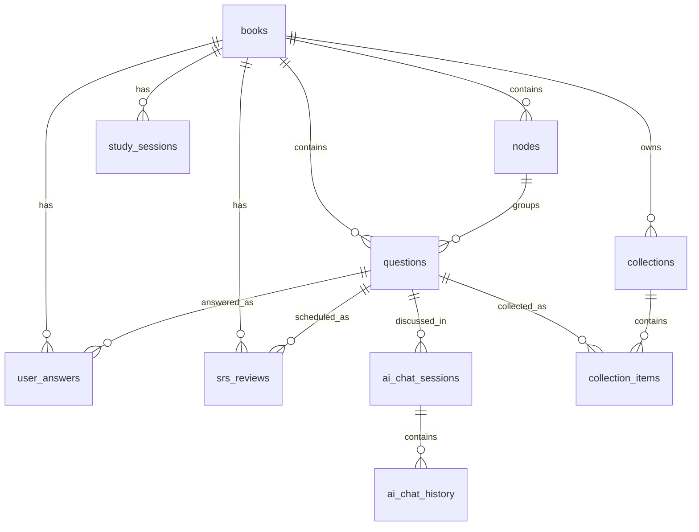

# Database Design

Mnemora stores app content and study state in a local Room database named
`quiz.db`. The current Room schema is `AppDatabase` version 17, exported under
`app/schemas/com.hihusky.mnemora.data.local.db.AppDatabase/17.json`.

The database is local-first and intentionally scoped to app data. User settings
such as AI provider, model, sound, and haptic preferences live in DataStore via
`SettingsRepository`, not in Room.

## Ownership

| Layer | Code | Responsibility |
|---|---|---|
| Database | `data/local/db/AppDatabase.kt` | Declares all Room entities and DAOs |
| DI | `di/DatabaseModule.kt` | Builds the singleton Room database as `quiz.db` |
| Entities | `data/local/db/entity/` | Defines table names, columns, foreign keys, and indexes |
| DAOs | `data/local/db/dao/` | Owns SQL queries and insert/update/delete operations |
| Repository | `data/repository/DatabaseRepository.kt` | Converts entities to domain models and coordinates DAO calls |
| Import | `domain/service/BookImporter.kt` | Inserts books, nodes, and questions inside a Room transaction |

## Naming Direction

`books` is the historical table name. It is not the best name for the current
domain because the top-level object is an imported question package/question
bank, not necessarily a book. The product language should move toward
`package` or `question_bank`. The current code keeps `books` / `BookEntity` for
compatibility with the existing repository and UI, but new design work should
treat it as the package boundary and avoid adding new cross-package behavior.

## Entity Map

`nodes.parentId` and `questions.parentId` are logical parent links. They are
not declared as self-referencing foreign keys.

## Tables

### `books`

Imported package metadata.

| Column | Type | Notes |
|---|---|---|
| `id` | `INTEGER` | Auto-generated primary key |
| `filename` | `TEXT NOT NULL` | Package id; import skips duplicates by matching this value |
| `name` | `TEXT` | Display name from `data.json`, defaults to `Imported` during import |
| `description` | `TEXT` | Optional package description |
| `totalQuestions` | `INTEGER NOT NULL` | Updated after import transaction counts inserted questions |
| `totalNodes` | `INTEGER NOT NULL` | Updated after import transaction counts inserted nodes |
| `sortOrder` | `INTEGER NOT NULL` | Manual ordering tie-breaker |
| `icon` | `TEXT` | Optional package icon value |
| `createdAt` | `INTEGER NOT NULL` | Millisecond timestamp |
| `updatedAt` | `INTEGER NOT NULL` | Millisecond timestamp; defaults to `createdAt` |

Library ordering uses `MAX(study_sessions.lastActiveTime)` first, then
`books.updatedAt`, `books.createdAt`, `sortOrder`, and `id`.

### `nodes`

Tree nodes inside a book.

| Column | Type | Notes |
|---|---|---|
| `id` | `TEXT` | Primary key generated during import from package id, depth, and sibling index |
| `bookId` | `INTEGER NOT NULL` | Foreign key to `books.id`, cascade delete |
| `parentId` | `TEXT` | Logical parent node id; `NULL` means root |
| `title` | `TEXT` | Optional node title |
| `questionCount` | `INTEGER NOT NULL` | Reserved count field; current import leaves this at default `0` |
| `sortOrder` | `INTEGER NOT NULL` | Sibling order from package position |
| `depth` | `INTEGER NOT NULL` | Import depth, starting at `0` |

Indexes: `bookId`, `parentId`.

The package schema permits arbitrary nesting, but `BookImporter` rejects imports
deeper than 5 levels to keep the UI manageable.

### `questions`

Question records imported from package `data.json`.

| Column | Type | Notes |
|---|---|---|
| `id` | `INTEGER` | Auto-generated primary key |
| `bookId` | `INTEGER NOT NULL` | Foreign key to `books.id`, cascade delete |
| `nodeId` | `TEXT` | Foreign key to `nodes.id`, cascade delete |
| `parentId` | `INTEGER` | Logical parent question id for passage sub-questions |
| `content` | `TEXT` | Prompt, passage, or flashcard content |
| `choices` | `TEXT` | JSON array of `QuestionChoice` objects |
| `answer` | `TEXT` | Correct answer payload |
| `explanation` | `TEXT` | Optional explanation |
| `questionType` | `TEXT NOT NULL` | Protocol value, defaults to `multiple_choice` |
| `frontTemplate` | `TEXT` | Optional flashcard front template |
| `backTemplate` | `TEXT` | Optional flashcard back template |

Indexes: `bookId`, `nodeId`.

Supported question type values are `multiple_choice`, `true_false`,
`fill_blank`, `cloze`, `flashcard`, and `passage`. Unknown protocol values map
to `QuestionType.Unknown` in the domain model. `passage` questions are treated
as non-answerable parent content; `QuestionDao.getAnswerableQuestionIds()`
excludes them.

### `user_answers`

Latest per-question answer and mark state.

| Column | Type | Notes |
|---|---|---|
| `questionId` | `INTEGER` | Primary key; foreign key to `questions.id`, cascade delete |
| `bookId` | `INTEGER NOT NULL` | Foreign key to `books.id`, cascade delete |
| `selected` | `TEXT` | User-selected answer payload |
| `isCorrect` | `INTEGER` | Nullable boolean encoded as `1` / `0`; `NULL` means no current answer |
| `markedWrong` | `INTEGER NOT NULL` | Legacy/manual wrong marker field; current queries use `isCorrect = 0` |
| `isMarked` | `INTEGER NOT NULL` | Bookmark flag encoded as `1` / `0` |
| `timestamp` | `INTEGER NOT NULL` | Millisecond timestamp for latest answer or mark update |

Index: `bookId`.

Saving an answer uses `OnConflictStrategy.REPLACE`, so there is one current
answer row per question. Clearing an answer sets `selected` and `isCorrect` to
`NULL` while preserving the row and any mark state.

### `srs_reviews`

Spaced repetition scheduling state per question.

| Column | Type | Notes |
|---|---|---|
| `questionId` | `INTEGER` | Primary key; foreign key to `questions.id`, cascade delete |
| `bookId` | `INTEGER NOT NULL` | Foreign key to `books.id`, cascade delete |
| `intervalDays` | `INTEGER NOT NULL` | Current review interval |
| `easeFactor` | `REAL NOT NULL` | Scheduling ease factor, default `2.5` |
| `repetitions` | `INTEGER NOT NULL` | Successful review count |
| `lapses` | `INTEGER NOT NULL` | Failed review count |
| `dueDate` | `INTEGER` | Nullable millisecond timestamp |
| `lastReviewed` | `INTEGER` | Nullable millisecond timestamp |
| `reviewState` | `INTEGER NOT NULL` | Ordinal for `New`, `Learning`, `Review`, `Relearning` |

Indexes: `bookId`, `dueDate`.

Due review queries select rows with `dueDate <= now`. SRS stats group
`reviewState = 0` as new cards, `1` and `3` as learning, and `2` as review.

### `ai_chat_sessions`

AI chat sessions attached to a question.

| Column | Type | Notes |
|---|---|---|
| `id` | `INTEGER` | Auto-generated primary key |
| `questionId` | `INTEGER NOT NULL` | Foreign key to `questions.id`, cascade delete |
| `title` | `TEXT` | Session title |
| `createdAt` | `INTEGER NOT NULL` | Millisecond timestamp |

Index: `questionId`.

Sessions for a question are shown newest first by `createdAt DESC`.

### `ai_chat_history`

Messages inside an AI chat session.

| Column | Type | Notes |
|---|---|---|
| `id` | `INTEGER` | Auto-generated primary key |
| `sessionId` | `INTEGER NOT NULL` | Foreign key to `ai_chat_sessions.id`, cascade delete |
| `text` | `TEXT NOT NULL` | Message body |
| `isUser` | `INTEGER NOT NULL` | Boolean encoded as `1` for user and `0` for assistant |
| `timestamp` | `INTEGER NOT NULL` | Millisecond timestamp |

Index: `sessionId`.

Messages are read oldest first by `timestamp ASC`.

### `collections`

User-defined or smart collections scoped to one imported package.

| Column | Type | Notes |
|---|---|---|
| `id` | `INTEGER` | Auto-generated primary key |
| `bookId` | `INTEGER NOT NULL` | Foreign key to `books.id`, cascade delete |
| `kind` | `TEXT NOT NULL` | `custom` or `smart`, mapped case-insensitively |
| `behavior` | `TEXT NOT NULL` | `manual` or `smartfilter`, mapped case-insensitively |
| `name` | `TEXT NOT NULL` | Display name |
| `description` | `TEXT` | Optional description |
| `config` | `TEXT` | Optional behavior config JSON |
| `sortOrder` | `INTEGER NOT NULL` | Collection ordering |
| `createdAt` | `INTEGER NOT NULL` | Millisecond timestamp |
| `updatedAt` | `INTEGER` | Nullable millisecond timestamp |

Indexes: `bookId`, `kind`.

Collections no longer support cross-package membership. The current UI creates
manual custom collections from the package detail screen. Smart collection
fields exist in the schema and model, but smart filtering is not yet implemented
in DAO queries.

### `collection_items`

Membership rows connecting package-local collections directly to questions.

| Column | Type | Notes |
|---|---|---|
| `id` | `INTEGER` | Auto-generated primary key |
| `collectionId` | `INTEGER NOT NULL` | Foreign key to `collections.id`, cascade delete |
| `questionId` | `INTEGER NOT NULL` | Foreign key to `questions.id`, cascade delete |
| `position` | `INTEGER NOT NULL` | Manual ordering inside the collection |
| `addedAt` | `INTEGER NOT NULL` | Millisecond timestamp |

Indexes: `collectionId`, `questionId`, unique `(collectionId, questionId)`.

Collection detail reads join `collection_items` directly to `questions`, ordered
by `position ASC, addedAt ASC`.

### `study_sessions`

Study progress and records for Practice, Review, Preview, and Test modes.

| Column | Type | Notes |
|---|---|---|
| `id` | `INTEGER` | Auto-generated primary key |
| `bookId` | `INTEGER NOT NULL` | Foreign key to `books.id`, cascade delete |
| `mode` | `TEXT NOT NULL` | `Practice`, `Review`, `Preview`, or `Test` |
| `startTime` | `INTEGER NOT NULL` | Millisecond timestamp |
| `lastActiveTime` | `INTEGER NOT NULL` | Millisecond timestamp used for recency |
| `currentIndex` | `INTEGER NOT NULL` | Last known position in the session |
| `totalQuestions` | `INTEGER NOT NULL` | Session question count |
| `isCompleted` | `INTEGER NOT NULL` | Boolean encoded by Room |
| `isActive` | `INTEGER NOT NULL` | Resume eligibility flag encoded by Room |
| `answersJson` | `TEXT` | Optional serialized answer state |
| `collectionId` | `INTEGER` | Optional collection context; not a declared foreign key |
| `nodeId` | `TEXT` | Optional node context; not a declared foreign key |

Indexes: `(bookId, mode, isActive)`, `(bookId, startTime)`.

The DAO keeps at most one active session per book and mode by explicitly
deactivating previous sessions before creating or resuming flows. Test-mode
resume is intentionally limited because test questions are reshuffled on load;
see ADR-0006.

## Core Flows

### Package import

1. `PackageService` validates a `.zip`, `.quizpkg`, or `.mnemorapkg` archive.
2. The archive is extracted into internal storage under `files/packages/<packageId>`.
3. `data.json` is decoded into plain values.
4. `BookImporter.importData()` checks `books.filename` for duplicate package ids.
5. A Room transaction inserts one `books` row, all `nodes`, all `questions`, and
   finally updates `books.totalQuestions` and `books.totalNodes`.

If the import fails, the transaction rolls back and the extracted package
directory is deleted by `PackageService`.

### Practice and test answers

Answer state is stored in `user_answers` by `questionId`. This means the table
stores the latest known answer per question rather than a historical answer log.
Session history and resume position are tracked separately in `study_sessions`.

### Review scheduling

Review mode reads due question ids from `srs_reviews` and writes the updated
scheduling state back to the same row with `OnConflictStrategy.REPLACE`.
Question content remains in `questions`.

### Collections

Collections point directly at `questions`. `collections.bookId` ensures
collection lists are shown only within the owning package, and repository code
validates package ownership before adding a question to a collection. There is
no snapshot table; `questions` is the single source of truth for question
content.

### AI chat

AI chat data is scoped to questions. Deleting a question cascades to its chat
sessions, and deleting a chat session cascades to its messages.

## Deletion and Cascades

Deleting a `books` row is the package-level deletion operation. It cascades
through declared foreign keys to `nodes`, `questions`, `user_answers`,
`srs_reviews`, `study_sessions`, and `collections`. Deleting questions cascades
to AI chat sessions, AI chat history, and collection items that reference those
questions.

## Migration Strategy

`DatabaseModule` builds Room with
`fallbackToDestructiveMigration(dropAllTables = true)`. There are no hand-written
migrations for version 17. Schema JSON files are exported so Room can verify the
schema and future migrations can be written from a concrete historical record.

Database backup is excluded by `res/xml/backup_rules.xml` and
`res/xml/data_extraction_rules.xml`.

## Consistency Checklist

When changing the database:

- Add or update the entity in `data/local/db/entity/`.
- Register new entities and DAOs in `AppDatabase.kt`.
- Add DAO providers in `DatabaseModule.kt`.
- Update `DatabaseRepository` conversions if domain models change.
- Increment the Room database version and commit the exported schema JSON.
- Update this document and any affected ADRs.
- Revisit destructive migration before shipping persistent user data.
